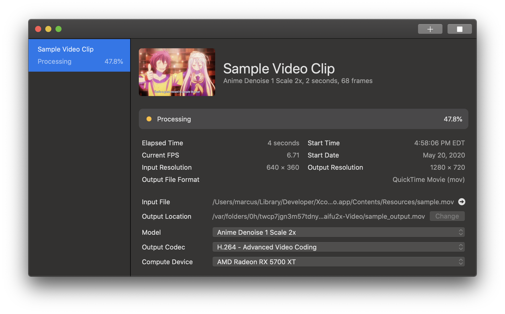

=========================

A video (only) super-resolution application powered by Waifu2x, SwiftUI, Metal, and CoreML. GPLv3 Licensed.

    
    Copyright © 2018-2020 Marcus Zhou. All rights reserved.
    
    Waifu2x Video is free software: you can redistribute it and/or modify
    it under the terms of the GNU General Public License as published by
    the Free Software Foundation, either version 3 of the License, or
    (at your option) any later version.
    
    Waifu2x Video is distributed in the hope that it will be useful,
    but WITHOUT ANY WARRANTY; without even the implied warranty of
    MERCHANTABILITY or FITNESS FOR A PARTICULAR PURPOSE.  See the
    GNU General Public License for more details.
    
    You should have received a copy of the GNU General Public License
    along with Waifu2x Video.  If not, see <http://www.gnu.org/licenses/>.
    

## Installation

Download the compiled binary from [Releases](https://github.com/SuperMarcus/waifu2x-video-mac/releases). Decompress the `zip` file and drag `Waifu2x Video.app` into your Applications folder.

## Usage

Waifu2x Video will only work for systems running macOS 10.15 or higher. The graphical interface is intuitive enough so you should be able to figure out how to use it by yourself.

## Credits

- [waifu2x](https://github.com/nagadomi/waifu2x)
- Inspired by [waifu2x-mac](https://github.com/imxieyi/waifu2x-mac)
